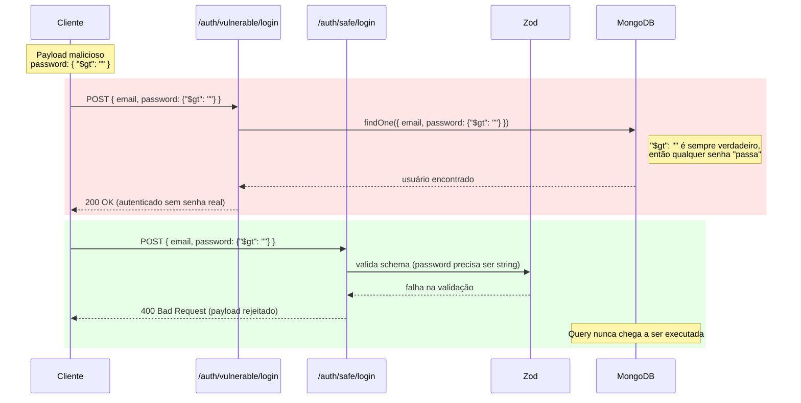
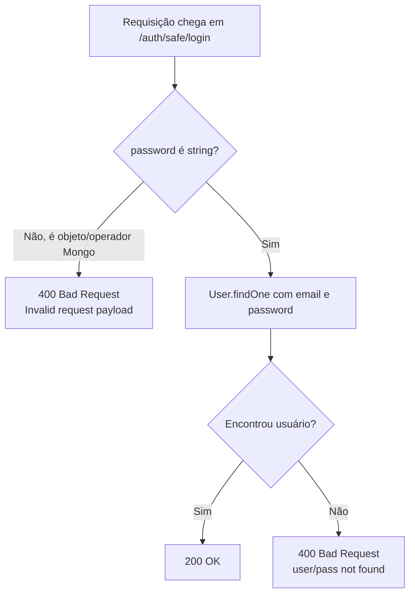

# NoSQL Injection POC

[](https://github.com/Felps03/NoSQL-Injection/actions/workflows/ci.yml)
[](./LICENSE)
[](https://nodejs.org)

## Sobre o projeto

Este projeto é uma prova de conceito (POC) educacional que demonstra, de forma prática, como uma NoSQL Injection acontece em uma API Node.js com MongoDB — e como uma validação de entrada bem feita (com [Zod](https://zod.dev/)) neutraliza o mesmo ataque.

A API expõe duas rotas de login equivalentes: uma vulnerável de propósito e uma segura, para comparação lado a lado.

## Aviso de segurança

Este projeto existe **apenas para fins de estudo e conscientização defensiva**, para ser rodado em ambiente local/controlado (sua máquina, um container Docker isolado). Ele não deve ser exposto publicamente, usado contra sistemas de terceiros, nem tratado como ferramenta ofensiva. O objetivo é entender a vulnerabilidade para saber preveni-la, não explorá-la fora deste ambiente de estudo.

## Stack

- Node.js 24
- Express 5
- MongoDB
- Mongoose 8
- Zod
- Jest
- Supertest
- mongodb-memory-server
- Docker
- Docker Compose

## Requisitos

- Node.js 24+
- npm
- Docker e Docker Compose, se for rodar via container

## Instalação local

```bash
npm install
```

## Variáveis de ambiente

O arquivo `.env.example` documenta as variáveis usadas pela aplicação:

```env
NODE_ENV=development
PORT=3333
MONGO_URL=mongodb://localhost:27017/nosql-injection
```

- `NODE_ENV`: controla o modo de execução (em `development`, erros não tratados retornam stack trace detalhado via Youch).
- `PORT`: porta HTTP em que o servidor escuta.
- `MONGO_URL`: string de conexão do MongoDB. É obrigatória — a aplicação falha ao subir se ela não estiver definida.

Copie o arquivo para `.env` e ajuste conforme necessário:

```bash
cp .env.example .env
```

## Rodando localmente

Com um MongoDB disponível em `localhost:27017`:

```bash
MONGO_URL=mongodb://localhost:27017/nosql-injection npm run dev
```

Ou, usando um arquivo `.env` já configurado:

```bash
npm run dev
```

## Rodando com Docker

```bash
docker compose up --build
```

Isso sobe a API e um MongoDB juntos, já conectados entre si. Para validar que a API está no ar:

```bash
curl http://localhost:3333/health
```

Para encerrar:

```bash
docker compose down
```

## Rodando os testes

```bash
npm test
```

Os testes de integração usam [mongodb-memory-server](https://github.com/typegoose/mongodb-memory-server), que sobe um MongoDB in-memory automaticamente. Não é preciso ter um MongoDB real rodando para testar.

## Scripts disponíveis

- `npm start` — inicia a aplicação em modo produção.
- `npm run dev` — inicia a aplicação com reload automático (`node --watch`).
- `npm test` — roda a suíte de testes (Jest + Supertest).
- `npm run lint` — verifica o código com ESLint.
- `npm run lint:fix` — corrige automaticamente o que for possível.
- `npm run format` — formata o código com Prettier.
- `npm run format:check` — verifica a formatação sem alterar arquivos.

## Rotas da API

| Método | Rota                     | Descrição                                  |
| ------ | ------------------------ | ------------------------------------------- |
| GET    | `/health`                | Verifica se a API está no ar                |
| GET    | `/users`                 | Lista os usuários cadastrados               |
| POST   | `/users`                 | Cria um usuário                             |
| POST   | `/auth/vulnerable/login` | Login vulnerável a NoSQL Injection          |
| POST   | `/auth/safe/login`       | Login protegido com validação via Zod       |

## Exemplo: criar usuário

```bash
curl -X POST http://localhost:3333/users \
  -H "Content-Type: application/json" \
  -d '{"email":"teste@example.com","password":"123456"}'
```

## Exemplo: login vulnerável

Login normal, com senha correta:

```bash
curl -X POST http://localhost:3333/auth/vulnerable/login \
  -H "Content-Type: application/json" \
  -d '{"email":"teste@example.com","password":"123456"}'
```

Payload educacional de NoSQL Injection — em vez de enviar uma senha, envia-se um operador do MongoDB (`$gt`, "maior que uma string vazia"), que é sempre verdadeiro:

```bash
curl -X POST http://localhost:3333/auth/vulnerable/login \
  -H "Content-Type: application/json" \
  -d '{"email":"teste@example.com","password":{"$gt":""}}'
```

Essa rota autentica o usuário mesmo sem saber a senha real. Isso acontece porque `req.body` é passado direto para a query do Mongoose (`User.findOne({ email, password })`), sem validar o tipo do campo `password`. A rota é vulnerável **de propósito**, para fins de demonstração.

## Exemplo: login seguro

Login normal, com senha correta:

```bash
curl -X POST http://localhost:3333/auth/safe/login \
  -H "Content-Type: application/json" \
  -d '{"email":"teste@example.com","password":"123456"}'
```

O mesmo payload de injeção, agora bloqueado:

```bash
curl -X POST http://localhost:3333/auth/safe/login \
  -H "Content-Type: application/json" \
  -d '{"email":"teste@example.com","password":{"$gt":""}}'
```

Aqui, o Zod valida o corpo da requisição antes de qualquer query no banco, exigindo que `password` seja uma `string`. Um objeto como `{"$gt": ""}` falha na validação e a API responde `400 Bad Request`, sem nunca chegar a montar a query no MongoDB.

## Diagrama: vulnerável vs. seguro

O diagrama abaixo compara o mesmo payload de ataque (`password: { "$gt": "" }`) passando pelas duas rotas:



Fluxograma da decisão que o Zod introduz antes da query:



## Como prevenir NoSQL Injection

- Validar toda entrada do usuário antes de usá-la.
- Rejeitar objetos onde se espera um tipo primitivo (string, number etc.).
- Usar validação de schema (Zod, Joi, ou similar) na borda da aplicação.
- Sanitizar payloads antes de repassá-los para queries.
- Nunca passar `req.body` diretamente para uma query do banco.
- Nunca confiar em dados vindos do cliente.
- Em projetos reais, usar autenticação de verdade (tokens, sessões, OAuth etc.).
- Em projetos reais, sempre hashear senhas (bcrypt, argon2 etc.) — nunca armazená-las em texto puro.

## Decisões de modernização

- Node 10 → Node 24.
- Babel removido — o projeto roda ESM nativo, sem transpilação.
- Cluster removido.
- Express 4 → Express 5.
- Mongoose 5 → Mongoose 8.
- Sequelize e PostgreSQL removidos — o projeto usa apenas MongoDB via Mongoose.
- Webpack removido.
- Configuração antiga de Husky removida.
- Jest e Supertest atualizados para as versões mais recentes.
- Testes de integração adicionados para as rotas de saúde, usuários e autenticação.
- Dockerfile atualizado para Node 24 e build sem Babel.
- Docker Compose adicionado, com serviço de MongoDB incluso.
- README reescrito para refletir o estado atual do projeto.
- CI adicionado via GitHub Actions (lint, format check e testes em cada push/PR).

## Estrutura de pastas

```
.
├── .github
│   └── workflows
│       └── ci.yml            # Pipeline de CI (lint, format check e testes)
├── src
│   ├── app
│   │   ├── controllers      # Regras de cada rota (Health, Users, Auth)
│   │   └── schemas          # Schemas do Mongoose (dados) e do Zod (validação)
│   ├── database             # Conexão com o MongoDB
│   ├── helpers              # Logger e enums (códigos HTTP)
│   ├── routes                # Definição das rotas por domínio
│   ├── app.js                # Configuração do Express
│   └── server.js             # Ponto de entrada da aplicação
├── __tests__
│   ├── integration           # Testes de integração (Supertest)
│   └── support               # Setup do mongodb-memory-server
├── swagger
│   └── openapi.yaml          # Documentação OpenAPI da API
├── postman
│   └── NoSQL Injection.postman_collection.json
├── Dockerfile
├── docker-compose.yml
└── .env.example
```

## CI

O workflow em `.github/workflows/ci.yml` roda em todo push para `master` e em pull requests, executando:

1. `npm ci`
2. `npm run lint`
3. `npm run format:check`
4. `npm test`

## Próximos passos

Sugestões de evolução, fora do escopo desta POC:

- Adicionar bcrypt para hashear senhas.
- Adicionar autenticação real (JWT, sessões etc.).
- Adicionar rate limit nas rotas de login.
- Melhorar o tratamento de erros (respostas mais específicas por tipo de falha).
- Publicar a documentação HTML do Swagger.
- Melhorar a cobertura de testes nos blocos de erro (`catch`) dos controllers.
